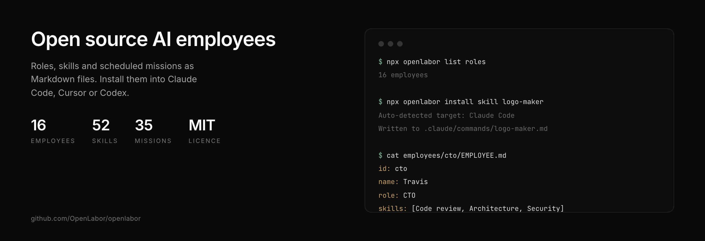

<p align="center">
  
</p>

<h1 align="center">OpenLabor</h1>

<p align="center">
  <strong>Open source AI employees. Roles, skills and scheduled missions as Markdown files — install them into Claude Code, Cursor or Codex, or run them on the OpenLabor platform.</strong>
</p>

<p align="center">
  <a href="https://github.com/OpenLabor/openlabor/blob/main/LICENSE"></a>
  <a href="https://www.npmjs.com/package/openlabor"></a>
  <a href="https://x.com/openlaborai"></a>
</p>

---

## What is in this repo

**16 employees · 52 skills · 35 missions.** Every one of them is Markdown.

```
employees/cto/EMPLOYEE.md          who Travis is, and what he will not do
skills/logo-maker/SKILL.md         a workflow: steps, APIs, scoring, examples
missions/weekly-security-audit/    a job that runs on a schedule
```

There is no DSL and no graph. The people who write these at our customers are not
engineers, and a Markdown file is the only format they will actually edit.

## Try it in 60 seconds

No account, no key. The catalog ships inside the package, so this works offline
after the first install.

```bash
npx openlabor list roles                 # 16 employees
npx openlabor list skills                # 52 skills
npx openlabor search logo                # search across both

npx openlabor install skill logo-maker   # copy the workflow into your editor
npx openlabor install role cto           # copy a persona into your editor
```

`install` auto-detects your tool and writes a local prompt file. Nothing phones home.

| Target | Flag | Writes to |
|---|---|---|
| Claude Code | `--target claude` | `.claude/commands/<name>.md` |
| Cursor | `--target cursor` | `.cursor/rules/<name>.mdc` |
| Codex | `--target codex` | `codex.md` (appended) |
| OpenCode | `--target opencode` | `opencode.md` (appended) |
| Windsurf | `--target windsurf` | `.windsurfrules` (appended) |
| Plain file | `--target raw` | `./<name>.md` |

Then, in Claude Code:

```
You:    /logo-maker
Claude: [runs the workflow — concepts, generation, scoring]
```

Your tool does the work. The file is the skill.

---

## Two ways to use OpenLabor

| | Install (free, no account) | Pilot (account required) |
|---|---|---|
| **What** | Copy skills and personas into your coding tool as local prompts | Talk to AI employees running on the OpenLabor platform |
| **How** | `openlabor install skill logo-maker` | `openlabor ask madison "task"` |
| **Runs where** | Locally, in your tool | On the platform |
| **Needs an account** | No | Yes |
| **Does real work** | Your tool roleplays the persona | Yes — real tools, APIs, credentials, and its own computer |
| **Best for** | Trying the workflows before signing up | Teams putting AI employees to work |

### Pilot your team

```bash
npm install -g openlabor

openlabor login                          # browser sign-in
openlabor team                           # who is on your team
openlabor ask "Draft 3 tweet threads about our launch"
openlabor ask cto "Review our auth module"
openlabor chat "Make the second one more casual"
openlabor history
openlabor tasks madison
openlabor run <task-id>
```

Works from any tool that can run a shell command, or from your terminal.
Run `openlabor --help` for the full command list, including `hire`, `upload`,
`download`, `skill create` and `context`.

---

## The 16 employees

| Role | Name | Department | Tagline |
|---|---|---|---|
| Accountant | Penny | Finance | Your books, always clean |
| Data Analyst | Derek | Data | Finds the insight you missed |
| Domain & Brand Advisor | Brandon | Marketing | Finds the perfect name before someone else does |
| CMO | Madison | Marketing | Runs your entire marketing engine |
| COO | Oliver | Operations | Runs ops so you don't have to |
| CTO | Travis | Engineering | Ships code while you sleep |
| Designer | Daisy | Design | Designs like it has taste |
| Email Secretary | Reed | Operations | Inbox zero, every single day |
| HR Manager | Holly | HR | Hires faster than recruiters |
| Lead Finder | Chase | Sales | Fills your pipeline while you sleep |
| Logo Designer | Logan | Design | Crafts logos that stick |
| SDR | Hunter | Sales | Books meetings you never could |
| Social Media Manager | Sierra | Marketing | Grows your following on autopilot |
| Travel Agent | Tara | Operations | Books the trip you'd plan yourself |
| Content Writer | Penelope | Content | Writes better than your last hire |
| X Manager | Xavier | Marketing | Turns your X into a growth machine |

Browse them in [`employees/`](employees/).

## The 52 skills

| Category | Count | Examples |
|---|---|---|
| Strategy | 11 | Bezos customer obsession, Munger inversion thinking, Taleb antifragility, competitor analysis |
| Content Creation | 7 | Image generator, video generator, content humanizer, YouTube shorts pipeline |
| Marketing | 7 | SEO optimization, conversion audit, growth experiment, marketing psychology |
| Sales | 6 | Cold outreach, lead qualification, high-volume outreach |
| Research | 5 | Web research, multi-platform research, news trend monitor, domain checker |
| Finance | 4 | Stripe manager, finance dashboard, capital allocation, risk assessment |
| Social Media | 4 | Instagram, LinkedIn, Reddit, YouTube |
| Productivity | 3 | Airtable manager, Google Calendar, meeting extractor |
| Agent Intelligence | 2 | Prompt engineering, self-improving agent |
| Analytics, Design, other | 3 | Data analyst, logo maker |

Browse them in [`skills/`](skills/).

## The 35 missions

Missions are the recurring work — the part that runs whether anyone asks or not.

| Category | Count | Examples |
|---|---|---|
| Marketing | 7 | Brand mention monitor, campaign performance review, daily engagement sweep |
| Operations | 6 | Daily calendar prep, team standup summary, monthly process audit |
| Design | 5 | UI component audit, brand consistency report, logo refresh concepts |
| Sales | 5 | Intent signal monitor, pipeline follow-up sweep, weekly lead list builder |
| Analytics | 2 | Weekly revenue dashboard, monthly market research report |
| Branding | 2 | Monthly brand health report, quarterly naming workshop |
| Content | 2 | Daily SEO blog draft, monthly content calendar planning |
| Engineering | 2 | Weekly dependency update, weekly security audit |
| Finance | 2 | Monthly financial close, weekly cash flow forecast |
| HR | 2 | Employee sentiment scan, onboarding feedback report |

Browse them in [`missions/`](missions/).

---

## The file format

An employee is a directory with an `EMPLOYEE.md`:

```yaml
---
id: cto
name: Travis
role: CTO
department: Engineering
tagline: "Ships code while you sleep"
skills:
  - "Code review"
  - "Architecture planning"
  - "Bug fixing"
  - "Security audits"
---
```

A skill is a full workflow, not a one-line prompt:

```yaml
---
name: logo-maker
description: Generate professional logomarks and wordmarks
category: Design
triggers:
  - "make a logo"
  - "create logo"
---

# Step 1: Understand the brand
# Step 2: Craft the prompt
# Step 3: Generate with Replicate (Flux)
# Step 4: Generate with Google Imagen
# Step 5: Score and pick
```

A mission is the same shape plus a schedule.

## What is not in this repo

The hosted product. OpenLabor is a workspace where several people task the same
employees in one thread, each employee on its own machine, with one memory the whole
company writes to. That runtime is not open source.

What is here is the catalog and the CLI, under MIT. If you want the files, take them.
If you want the multiplayer part, that is [openlabor.ai](https://openlabor.ai) —
$69/month, seven days free, no seats.

## Contributing

New skills, missions and employees are welcome — see [CONTRIBUTING.md](CONTRIBUTING.md)
for the format and what gets rejected. Short version: real steps, real APIs, a scoring
rule instead of "pick the best one", and the failure cases.

## Licence

MIT. See [LICENSE](LICENSE).
